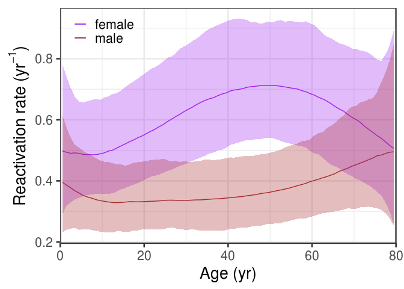

Updated: 17 October 2019

# Introduction

On this page I provide an overview of parameter inference using the endemic equilibrium of a transmission model tailored to the   epidemiology of cytomegalovirus in high-income countries. The model includes vertical transmission (congenitally and postnatally by breastfeeding/transfer of saliva), primary infection to uninfected persons, re-infection to latently infected persons, and infectious reactivation. The analyses are based on an earlier model  (<https://journals.plos.org/ploscompbiol/article?id=10.1371/journal.pcbi.1005719>), but with the following extensions: 
 
- Estimation of reactivation rates is not based on piecewise constant functions anymore but on cubic splines, using code by M. Kharratzadeh (<https://mc-stan.org/users/documentation/case-studies/splines_in_stan.html>). 

- For increased biological realism, the new transmission model allows for multiple re-infection and reactivation events during a person's lifetime. 

- Data from a birth prevalence study are included, and the model is extended to be able to estimate the probability of congenital transmission. This is an important extension as much of the health burden is due to congenital infections (which can lead to serious long-term sequelae).

The analyses and results presented here form the starting point of a manuscript that evaluates the impact of various vaccination strategies against CMV. Authors of the manuscript are Ganna Rozhnova, Mirjam Kretzschmar, Fiona van der Klis, Debbie van Baarle,
Marjolein Korndewal, Ann Vossen, and Michiel van Boven.

# Data

All data have been described and published elsewhere, and are available in the data directory or R script (<https://github.com/mvboven/cmv-vaccination>).

- The serological data have been analysed earlier (see <https://www.sciencedirect.com/science/article/pii/S1386653214004612>,  <https://journals.plos.org/ploscompbiol/article?id=10.1371/journal.pcbi.1005719>, and the PhD thesis of M. Korndewal, available at  <https://openaccess.leidenuniv.nl/handle/1887/45778>). As in our earlier analyses, from the serological study we select persons of Western ethnicity (ethnicity is a known independent risk factor for infection and the majority of persons in the Netherlands are of Western ethnicity), and exclude infants under 6 months (to prevent interference of maternal antibodies). Further, a subset of 651 samples are right-censored, so 2,842 and 2,337 samples from female and male participants are included in the analyses.

 - The cCMV birth prevalence data also have been described earlier (see <https://www.cambridge.org/core/journals/epidemiology-and-infection/article/disease-burden-of-congenital-cytomegalovirus-infection-at-school-entry-age-study-design-participation-rate-and-birth-prevalence/DED925A2D496FF0ED8DCDCA5E692AFB2/core-reader>, and in particular the PhD thesis of M.  Korndewal, available at <https://openaccess.leidenuniv.nl/handle/1887/45778>). In the birth prevalence study, 154 infants of a cohort of 31484 (0.5%) are found positive. This is broadly in line with findings from other high-income countries.

- Human contact data (stratified by sex, 16 age groups of 5 years) are as in our previous study. See <https://github.com/kassteele/Contact-patterns> for explanation, alternative options, and do-it-yourself instructions. 

- Ages of mothers in the Netherlands in 2006/2007 are taken from Statistics Netherlands (<http://www.cbs.nl>), see also the MSc thesis of Sophia de Jong (available on request).

# Stan model

## Data 

Data and fixed parameter values are specified in the data directory (serological data and contact matrix) and R script (all other). Throughout, I take the estimated means and standard deviations of the mixing distributions as estimated in our earlier analyses. The data block of the Stan model looks as follows:

```
data {
  int<lower=0> N;                             // number of subjects
  int<lower=1> DeltaA;                        // length of age intervals
  int<lower=1> A;                             // number of age intervals
  matrix<lower=0>[A, A] Contact_MM;           // gender- and age-specific contact matrices
  matrix<lower=0>[A, A] Contact_FM;           // male to female contact matrix
  matrix<lower=0>[A, A] Contact_MF;           // female to male contact matirx
  matrix<lower=0>[A, A] Contact_FF;           // female to female
  int<lower=0, upper=DeltaA*A> Ages[N];       // subject ages (rounded from months (LFTB2 in P2) to years)
  real Titers[N];                             // antibody titers
  int Censor[N];                              // 0 = normal, 1 = censored, 2 = spike (see mvb17)
  real RightCensor;                           // titers above this value are right-censored
  real MuS;                                   // mean of classification mixture (S) (estimated in mvb17)
  real MuL;                                   // mean of classification mixture (L)
  real MuB;                                   // mean of classification mixture (B)
  real<lower=0> SigmaS;                       // standard deviation of the uninfected component
  real<lower=0> SigmaL;                       // standard deviation of the infected component
  real<lower=0> SigmaB;                       // standard deviation of infected with raised antibodies
  int<lower=1> numbertestedinfants;           // # infants tested for cCMV - total: 31,484
  int<lower=1> numbercCMVinfants;             // # infants positive for cCMV - total: 154
  real<lower=0> Penalty;                      // estimation of the fois/S0: LHS ~ N(RHS,1/Penalty)
  int<lower=0, upper=1> Gender[N];            // 0 = female, 1 = male
  vector[A] BirthContribution;                // prob dist of ages of mothers with a newborn in 2006/2007 
  int num_knots;                              // number of spline knots
  vector[num_knots] knots;                    // the sequence of knots 
  int spline_degree;                          // the spline degree (order - 1)	
  real ts[DeltaA*A];                          // ages at which splines are calculated
  real<lower=0, upper=1> reducinf;            // infectivity reduction in L compared to B
  int<lower=0, upper=1> mode;                 // 0 = regular sampling, 1 = sampling to compute WBIC
}
```

## Parameters

Fundamental parameters of the model are the infectiousness of persons with a primary infection (beta_1), the infectiousness after re-infection or reactivation (beta_2), the reduced susceptibility to re-infection as compared with primary infection (z), the probability that re-infection or reactivation lead to antibody boosting (probLtoB), the fraction of the population that is uninfected at 6 months (i.e. not infected congenitally or postnatally) (S0), and the probabilities of congential infection from an acutely infected mother (qcCMV) and postnatal infection (e.g., by breastfeeding, transfer of saliva from mother to offspring) (nu). Also estimated are the spline wieghts for the reactivation rates in females and males (a_raw). The 16x2=32 nonlinear equations for the age-specific forces of infection at equilibrium ($\lambda_f$ and $\lambda_m$) that result after interval decomposition (16 for each sex; see e.g., Chapter 9 of <https://press.princeton.edu/titles/9916.html> for details) are efficiently solved using a trick (see below). The parameter block is given by:

```
parameters {
  real<lower=0> beta1;                        // infectivity after primary infection
  real<lower=0> beta2;                        // infectivity after reactivation/re-infection in L or L/B
  real<lower=0, upper=1> z;                   // reduction in susceptibility to reinfection
  real<lower=0, upper=1> probLtoB;            // prob that reactivation/reinfection leads to Ab boosting
  real<lower=0> S0;                           // fraction of the population not vertically infected
  real<lower=0, upper=1> qcCMV;               // prob of cCMV during acute infection of mother
  real<lower=0> nu;                           // probability of vertical transmission
  matrix<lower=0>[2, num_basis] a_raw;        // spline basis functions; 1 = female, 2 = male
  vector<lower=0>[A] lambda_f;                // forces of infection on the age-intervals in females
  vector<lower=0>[A] lambda_m;                // forces of infection on the age-intervals in males
}
```

## Analysis

The transformed parameters block contains the specifications of the sex- and age-specific reactivation rates on age intervals, and the age-specific fractions in the S, L, or B compartments at points of the age intervals:

```
/* reactivation rates on age intervals */
vector<lower=0>[DeltaA*A] rho_f;              // reactivation rate in females on intervals            
vector<lower=0>[DeltaA*A] rho_m;              // reactivation rate in females on intervals

/* prevalence in S, L, and B at points of age intervals */
vector<lower=0, upper=1>[DeltaA*A+1] S_f;     // susceptible prevalence at points of intervals (female)
vector<lower=0, upper=1>[DeltaA*A+1] S_m;     // susceptible prevalence at points of intervals (male)
vector<lower=0, upper=1>[DeltaA*A+1] L_f;     // latently infected (female)
vector<lower=0, upper=1>[DeltaA*A+1] L_m;     // latently infected (male)
vector<lower=0, upper=1>[DeltaA*A+1] B_f;     // infected with boosted titers (female)
vector<lower=0, upper=1>[DeltaA*A+1] B_m;     // infected with boosted titers (male)
```

In addition, the transformed parameters block contains specifications of auxiliary parameters for efficient solution of the discretised ODEs (see below), and forces of infection on the (broader) age intervals for which the contact matrix is specified:

```
/* auxiliary vectors to efficiently solve ODEs for S, L, and B */
vector<lower=0, upper=1>[DeltaA*A+1] X_f;     // boys latently infected at birth
vector<lower=0, upper=1>[DeltaA*A+1] X_m;     // girls latently infected at birth
vector<lower=0>[DeltaA*A+1] Y_f;              // =(L_f-X_f)/X_f ratio in L infected hor/vert
vector<lower=0>[DeltaA*A+1] Y_m;              // =(L_m-X_m)/X_m

/* lambda hat (i.e. the force of infection) should be very similar to lambda */
vector<lower=0>[A] lambda_hat_f;
vector<lower=0>[A] lambda_hat_m;
```

Next, the main steps in the analysis are as follows:

- First, the ODEs for the age- and sex-specific prevalence at equilbrium are solved in terms of the forces of infection and other parameters low-level parameters. Details are available on request.

- Second, the resulting equations are discretised on a fine-grained mesh (now 1 year), assuming that rate parameters (i.e. reactivation rates) are constant on the intervals. The mesh can be made even more fine grained, or interpolations can be used to make the likelihood contributions of the serological data more precise. In our experience, there is little additional precision to be gained by such approaches. See below for code relating to the first two steps. 

```
/* solution of the ODEs S, L, B, and intermediates X/Y in terms of the foi in females and males      */
/* X : perinatally infected and still in L                                                           */
/* Y : ratio of persons in L that are infected after birth (L-X) over those infected perinatally (X) */
  
S_f = S0 * exp(-cumulative_sum(append_row(Zero, longLambda_f)));
S_m = S0 * exp(-cumulative_sum(append_row(Zero, longLambda_m)));

X_f = (1.0 - S0) * exp(-cumulative_sum(append_row(Zero, probLtoB * longPi_f)));
X_m = (1.0 - S0) * exp(-cumulative_sum(append_row(Zero, probLtoB * longPi_m)));
  
Y_f = cumulative_sum(append_row(Zero, longLambda_f .* (S_f[:DeltaA*A] ./ X_f[:DeltaA*A]) 
  .* (LongOnes - exp(-(longLambda_f - probLtoB * longPi_f))) ./ (longLambda_f - probLtoB * longPi_f)));
Y_m = cumulative_sum(append_row(Zero, longLambda_m .* (S_m[:DeltaA*A] ./ X_m[:DeltaA*A]) 
  .* (LongOnes - exp(-(longLambda_m - probLtoB * longPi_m))) ./ (longLambda_m - probLtoB * longPi_m)));

L_f = X_f .* (Y_f + LlongOnes);
L_m = X_m .* (Y_m + LlongOnes);

B_f = LlongOnes - S_f - L_f;
B_m = LlongOnes - S_m - L_m;
```

- Third, the discretised solutions for the prevalence in S, L, and B are inserted in the equations for the forces of infection, while using the short-disease approximation (acute infections are 2-4 orders of magnitude shorter than human lifespan). This procedure yields 16*2=32 (16 age groups, 2 sexes) non-linear equations for the forces of infection. See below for code:

```
/* new model (compared to mvb17) that splits between infectiousness from L vs B and enables estimation      */
/* of all parameters. It still may not entirely be biologically intuitive. A full model which distinguishes */
/* between infectiousness after reactivation and re-infection and allows cycling in L and B would need at   */
/* least five infected classes.                                                                             */
for (a in 1 : A) {
  aggr_S_f[a] = sum(longLambda_f[1+DeltaA*(a-1):DeltaA*a] .* S_f[1+DeltaA*(a-1):DeltaA*a]); 
  aggr_L_f[a] = sum((rho_f[1+DeltaA*(a-1):DeltaA*a] + z * longLambda_f[1+DeltaA*(a-1):DeltaA*a]) 
                    .* L_f[1+DeltaA*(a-1):DeltaA*a]); 
  aggr_L_m[a] = sum((rho_m[1+DeltaA*(a-1):DeltaA*a] + z * longLambda_m[1+DeltaA*(a-1):DeltaA*a]) 
                    .* L_m[1+DeltaA*(a-1):DeltaA*a]);
  aggr_B_f[a] = sum((rho_f[1+DeltaA*(a-1):DeltaA*a] + z * longLambda_f[1+DeltaA*(a-1):DeltaA*a]) 
                    .* B_f[1+DeltaA*(a-1):DeltaA*a]); 
  aggr_B_m[a] = sum((rho_m[1+DeltaA*(a-1):DeltaA*a] + z * longLambda_m[1+DeltaA*(a-1):DeltaA*a]) 
                    .* B_m[1+DeltaA*(a-1):DeltaA*a]);
}
lambda_hat_f = Contact_FF * (beta1 * (S_f[ReduceIdxs] - S_f[ReduceIdxsRightShift]) + reducinf * beta2 * aggr_L_f + beta2 * aggr_B_f) 
             + Contact_FM * (beta1 * (S_m[ReduceIdxs] - S_m[ReduceIdxsRightShift]) + reducinf * beta2 * aggr_L_m + beta2 * aggr_B_m);
lambda_hat_m = Contact_MM * (beta1 * (S_m[ReduceIdxs] - S_m[ReduceIdxsRightShift]) + reducinf * beta2 * aggr_L_m + beta2 * aggr_B_m) 
             + Contact_MF * (beta1 * (S_f[ReduceIdxs] - S_f[ReduceIdxsRightShift]) + reducinf * beta2 * aggr_L_f + beta2 * aggr_B_f);
```

- Finally, the equations for the forces of infection are solved, and the result is inserted in the solution of the ODEs. Here, the above equations are solved (quite efficiently), using Stan. More precisely, taking our parameters of interest (lambda_f and lambda_m) to be random variates, calculate the right-hand sides of the equations for the forces of infection (lambda_hat_f and lambda_hat_m), and obtain approximate solutions by assuming that lambda_f and lambda_m are normally distributed with means lambda_hat_f and lambda_hat_m and very small standard deviations (1/Penalty). The code in the parameters block is as follows:

```
/* penalise the difference between lambda and lambda_hat/S0 and S0_hat to solve the equations           */
/* lambda_f - lambda_hat_f ~ normal(0,1/Penalty) does not work: do  target += log(det(Jacobian))        */
/* future: use solver. I have tried this but now still seems prohibitively slow                         */
/* the formulation below can be viewed as a model in itself: A priori we would like to select parameter */
/* values that are compatible with a transmission model. Taking a high penalty, the result will match   */
/* the transmission model. For low penalty the result may differ from the transmission model.           */
/* Here, I have taken the penalty to be 10^4, which forces lambda and lambda_hat to be quite similar.   */

lambda_f ~ normal(lambda_hat_f, 1/Penalty);                
lambda_m ~ normal(lambda_hat_m, 1/Penalty);                
```

## Priors and likelihood

Apart from the forces of infection and fraction of the population that is susceptible explicit prior distributions are provided for the spline weights. Based on earlier analyses and the expectation that reactivation is a rare event, I take Gamma(2,50) prior distributions for all weights, yielding prior expectations for the reactivation rates of 0.04 per year. In a sensitivity analysis I have included a scenario in which reactivation is expected to be (much) more frequent (taking Gamma (10,20) prior distributions), yielding prior expectations of the reactivation rates of 0.5 per year.

```
model {    
  /* spline weights for the reactivation rates */
  for (s in 1:num_basis) {
   a_raw[,s] ~  gamma(2, 50);       // default, based on mvb17 and the premise that reactivation is rare
   //a_raw[,s] ~  gamma(10, 20);    // alternative, assuming that reactivation may occur frequently
  }
```
  
Next, the likelihood contains contributions from the serological study and birth cohort. See our earlier anaylses and the code below:
  
```  
/* data set 1: serological data from PIENTER2 study */
for ( i in 1 : N ) {// loop over subjects
   int aa;
   real pS; real pL; real pB;
      
   // improve readability
 aa = Ages[i] + 1; // the index for S, L and B
      
   // compute the compartment-probabilities given the subjects' age
   if ( Gender[i] == 0 ) { // 0 = female
      pS = S_f[aa];
      pL = L_f[aa];
      pB = B_f[aa];
   }
   else { // 1 = male
      pS = S_m[aa];
      pL = L_m[aa];
      pB = B_m[aa];
   }
      
   // likelihood contributions
   if ( Censor[i] == 0 ) { // normal data
     target += watanabe_beta * log( pS * exp(normal_lpdf(Titers[i] | MuS, SigmaS)) +
                                    pL * exp(normal_lpdf(Titers[i] | MuL, SigmaL)) +
                                    pB * exp(normal_lpdf(Titers[i] | MuB, SigmaB)) ); //or log_exp_sum 
   }
   else if ( Censor[i] == 1 ) { // right censored
          target += watanabe_beta * log( pS * exp(normal_lccdf(RightCensor | MuS, SigmaS)) +
                                         pL * exp(normal_lccdf(RightCensor | MuL, SigmaL)) +
                                         pB * exp(normal_lccdf(RightCensor | MuB, SigmaB)) );
        }
        else if ( Censor[i] == 2 ) { // spike
               target += watanabe_beta * log(pS);
             }
}
/* data set 2: cCMV cases from the CROCUS study (PhD thesis M Korndewal) */
target += watanabe_beta * binomial_lpmf(numbercCMVinfants | numbertestedinfants, pcCMV); 
}
```

# Results

Results as presented in Rozhnova et al (2019) are obtained with the following Stan settings:


```r
# estimate parameters with Stan
# main analysis with gamma(2,50) priors for spline weights
fit = stan(file = 'cmv_22082019.stan', 
           data = data_values, 
           init = parameter_inits, 
           iter = 2000, 
           warmup = 1000, 
           thin = 20, 
           chains = 20,
           control = list(adapt_delta = 0.97, max_treedepth = 15)
)
```

Running this may take a couple of hours, so let's load an earlier result (.rda file): 


```r
# Load the rda object
load(file = "cmv_22082019.rda")
```

As a first check, I plot the traceplots of the main parameters: 

<!-- -->

The traceplots look reasonable, so I proceed. 

Posterior quantiles of the main parameters also seem reasonable (compared to earlier analyses), effective sample sizes of all parameters are around 1,000, and Rhat is close to 1 for all parameters. This is reassuring:


```
Inference for Stan model: cmv (18042019).
20 chains, each with iter=2000; warmup=1000; thin=20; 
post-warmup draws per chain=50, total post-warmup draws=1000.

          mean se_mean    sd  2.5%   25%   50%   75% 97.5% n_eff  Rhat
beta1    0.003   0.000 0.003 0.000 0.001 0.002 0.004 0.010  1085 1.000
beta2    0.020   0.000 0.005 0.013 0.017 0.020 0.023 0.032  1036 1.000
z        0.446   0.008 0.278 0.029 0.203 0.420 0.666 0.953  1085 0.995
S0       0.833   0.000 0.014 0.805 0.824 0.833 0.842 0.861  1065 0.998
nu       0.369   0.001 0.030 0.311 0.349 0.370 0.389 0.429  1094 0.999
qcCMV    0.172   0.001 0.038 0.106 0.143 0.168 0.194 0.254  1082 1.001
probLtoB 0.495   0.003 0.114 0.315 0.418 0.476 0.558 0.760  1120 1.000

Samples were drawn using NUTS(diag_e) at Thu Aug 22 17:26:08 2019.
For each parameter, n_eff is a crude measure of effective sample size,
and Rhat is the potential scale reduction factor on split chains (at 
convergence, Rhat=1).
```

More checks can be done by inspection of derived parameters, i.e. the forces of infection and the reactivation rates in selected age groups. Again, all seems well:


```
Inference for Stan model: cmv (18042019).
20 chains, each with iter=2000; warmup=1000; thin=20; 
post-warmup draws per chain=50, total post-warmup draws=1000.

              mean se_mean    sd  2.5%   25%   50%   75% 97.5% n_eff  Rhat
lambda_f[1]  0.014   0.000 0.001 0.012 0.013 0.014 0.014 0.015  1125 1.005
lambda_f[2]  0.016   0.000 0.001 0.014 0.016 0.016 0.017 0.018  1171 1.005
lambda_f[3]  0.016   0.000 0.001 0.014 0.015 0.016 0.017 0.019  1153 0.997
lambda_f[4]  0.014   0.000 0.001 0.012 0.013 0.014 0.014 0.016  1025 0.997
lambda_f[5]  0.010   0.000 0.001 0.009 0.009 0.010 0.010 0.011   976 1.001
lambda_f[6]  0.010   0.000 0.001 0.009 0.010 0.010 0.011 0.012  1050 1.005
lambda_f[7]  0.012   0.000 0.001 0.011 0.011 0.012 0.012 0.013  1114 1.007
lambda_f[8]  0.012   0.000 0.001 0.011 0.012 0.012 0.012 0.013  1139 1.007
lambda_f[9]  0.012   0.000 0.001 0.010 0.011 0.011 0.012 0.013  1068 1.011
lambda_f[10] 0.011   0.000 0.001 0.010 0.011 0.011 0.012 0.013  1021 1.004
lambda_f[11] 0.011   0.000 0.001 0.009 0.010 0.011 0.011 0.012  1064 0.999
lambda_f[12] 0.010   0.000 0.001 0.008 0.009 0.009 0.010 0.011  1141 0.999
lambda_f[13] 0.009   0.000 0.001 0.008 0.008 0.009 0.010 0.011  1119 1.002
lambda_f[14] 0.010   0.000 0.001 0.008 0.009 0.010 0.011 0.012  1099 1.000
lambda_f[15] 0.009   0.000 0.001 0.007 0.008 0.008 0.009 0.011  1098 1.002
lambda_f[16] 0.006   0.000 0.001 0.005 0.006 0.006 0.007 0.008  1100 1.000
lambda_m[1]  0.012   0.000 0.001 0.011 0.012 0.012 0.012 0.013  1188 1.005
lambda_m[2]  0.015   0.000 0.001 0.013 0.014 0.015 0.015 0.017  1218 1.006
lambda_m[3]  0.013   0.000 0.001 0.012 0.013 0.013 0.014 0.015  1131 1.000
lambda_m[4]  0.011   0.000 0.001 0.009 0.010 0.011 0.011 0.012  1030 0.997
lambda_m[5]  0.008   0.000 0.000 0.007 0.007 0.008 0.008 0.009   909 1.001
lambda_m[6]  0.008   0.000 0.001 0.007 0.008 0.008 0.009 0.009   929 1.002
lambda_m[7]  0.010   0.000 0.001 0.009 0.010 0.010 0.010 0.011  1033 1.008
lambda_m[8]  0.012   0.000 0.001 0.011 0.012 0.012 0.013 0.014  1055 1.007
lambda_m[9]  0.011   0.000 0.001 0.010 0.011 0.011 0.012 0.013  1035 1.012
lambda_m[10] 0.010   0.000 0.001 0.009 0.010 0.010 0.011 0.012  1003 1.005
lambda_m[11] 0.010   0.000 0.001 0.008 0.009 0.010 0.010 0.011  1007 1.002
lambda_m[12] 0.009   0.000 0.001 0.008 0.009 0.009 0.010 0.011  1056 1.000
lambda_m[13] 0.011   0.000 0.001 0.009 0.010 0.011 0.011 0.013  1074 0.997
lambda_m[14] 0.009   0.000 0.001 0.007 0.009 0.009 0.010 0.012  1131 0.999
lambda_m[15] 0.008   0.000 0.001 0.006 0.008 0.008 0.009 0.011  1127 1.003
lambda_m[16] 0.008   0.000 0.001 0.006 0.007 0.008 0.009 0.011  1155 1.005
rho_f[25]    0.042   0.000 0.012 0.024 0.034 0.041 0.049 0.068   995 1.003
rho_f[50]    0.059   0.000 0.016 0.033 0.048 0.057 0.069 0.095  1038 1.005
rho_f[75]    0.049   0.001 0.019 0.021 0.035 0.047 0.060 0.092  1130 1.001
rho_m[25]    0.023   0.000 0.008 0.011 0.018 0.022 0.028 0.042  1042 0.997
rho_m[50]    0.025   0.000 0.008 0.011 0.019 0.024 0.029 0.043  1077 0.999
rho_m[75]    0.038   0.000 0.015 0.013 0.027 0.036 0.048 0.072  1131 0.998

Samples were drawn using NUTS(diag_e) at Thu Aug 22 17:26:08 2019.
For each parameter, n_eff is a crude measure of effective sample size,
and Rhat is the potential scale reduction factor on split chains (at 
convergence, Rhat=1).
```

Pair plots of the main parameters uncover strong correlations between some parameters, and substantial differences in precision of estimates. For instance, the reduction in susceptibiliy to re-infection as compared to primary infection (z) cannot be estimated with any meaningful precision, while there is a strong correlation between the fraction of of the population that is stil susceptible at 6 months (S0), and the probability of vertical transmission (nu):

<!-- -->

The above results make intuitive sense, and can be explained in biological terms. 

It is convenient to have the maximum a posteriori (MAP) estimate at hand for forward simulations from the endemic equilibrium. The MAP is also used to draw some of the figures in the  manuscript:


```r
# extract parameters
params = rstan::extract(fit)
# max(params$lp__)
posmax <- as.numeric(which(params$lp__ == max(params$lp__)))
MAP <- as.data.frame(fit)[posmax, c("beta1",
                                    "beta2",
                                    "z",
                                    "S0",
                                    "nu",
                                    "probLtoB",
                                    "qcCMV")] 
print(MAP, digits = 4)
```

```
      beta1   beta2      z     S0    nu probLtoB  qcCMV
721 0.00677 0.01792 0.3779 0.8583 0.321    0.491 0.1384
```

For model selection based on (approximations of) leave-one-out predictive performance, I use the loo package (see, e.g., <https://mc-stan.org/loo/> and references on that page):  


```r
LL = extract_log_lik(fit, parameter_name = 'log_lik')
loo(LL)
```

```
Warning: Relative effective sample sizes ('r_eff' argument) not specified.
For models fit with MCMC, the reported PSIS effective sample sizes and 
MCSE estimates will be over-optimistic.
```

```

Computed from 1000 by 5179 log-likelihood matrix

         Estimate    SE
elpd_loo -11071.8 184.4
p_loo         7.6   0.2
looic     22143.6 368.8
------
Monte Carlo SE of elpd_loo is 0.1.

All Pareto k estimates are good (k < 0.5).
See help('pareto-k-diagnostic') for details.
```

Finally, let's visualise the estimated prevalence in females and males, as well as the reactivation rates. The estimated prevalence are in good agreement with our earlier estimates (as they should). As in our earlier study, reactivation rate estimates are generally higher in females than in males.

Female prevalence:

<!-- -->

Male prevalence: 

<!-- -->

Reactivation rates:

<!-- -->

# Sensitivity analysis

Speaking from experience, the results (i.e. parameter estimates) are remarkably robust to variations in the prior distributions. In fact, explicit prior distributions are only specified for spline weights. The prior distributions for the weights do have a strong impact on the parameter estimates. Therefore, I show results for an alternative scenario with higher (gamma(10,20)) prior distributions for the splines weights. Results form the default scenario are removed, and an alternative scenario is loaded:


```r
# Load the rda object
rm(fit)
rm(params)
load(file = "high reactivation_10052019.rda")
params = rstan::extract(fit)
```

Again, the traces, effective sample sizes, Rhat, and pairplots suggest that the fitting procedure has delivered good results:

<!-- -->


```
Inference for Stan model: cmv (18042019).
20 chains, each with iter=2000; warmup=1000; thin=20; 
post-warmup draws per chain=50, total post-warmup draws=1000.

          mean se_mean    sd  2.5%   25%   50%   75% 97.5% n_eff  Rhat
beta1    0.003   0.000 0.003 0.000 0.001 0.002 0.004 0.011  1159 1.007
beta2    0.002   0.000 0.000 0.001 0.001 0.002 0.002 0.002  1138 1.000
z        0.485   0.009 0.291 0.023 0.223 0.493 0.728 0.980  1036 0.994
S0       0.835   0.000 0.013 0.810 0.826 0.835 0.844 0.863  1082 0.996
nu       0.364   0.001 0.028 0.305 0.346 0.366 0.382 0.419  1032 0.998
qcCMV    0.017   0.000 0.003 0.012 0.015 0.017 0.018 0.023  1016 1.004
probLtoB 0.039   0.000 0.004 0.031 0.036 0.038 0.041 0.048  1056 0.999

Samples were drawn using NUTS(diag_e) at Thu May  9 18:39:18 2019.
For each parameter, n_eff is a crude measure of effective sample size,
and Rhat is the potential scale reduction factor on split chains (at 
convergence, Rhat=1).
```

<!-- -->

LOOIC suggests that the variant model has slightly higher statistical support:


```r
LL = extract_log_lik(fit, parameter_name = 'log_lik')
loo(LL)
```

```
Warning: Relative effective sample sizes ('r_eff' argument) not specified.
For models fit with MCMC, the reported PSIS effective sample sizes and 
MCSE estimates will be over-optimistic.
```

```

Computed from 1000 by 5179 log-likelihood matrix

         Estimate    SE
elpd_loo -11071.3 184.4
p_loo         5.5   0.1
looic     22142.7 368.8
------
Monte Carlo SE of elpd_loo is 0.1.

All Pareto k estimates are good (k < 0.5).
See help('pareto-k-diagnostic') for details.
```

Next, as in the default scenario let's visualise the estimated prevalences in females and males, as well as the reactivation rates. 

Female prevalence:

<!-- -->

Male prevalence:

<!-- -->

Reactivation rates:

<!-- -->

Notice that there is very good correspondence for the prevalence in both sexes between the two scenarios, but that the reactivation rate is much higher in the scenario with high spline priors. The increase in the reactivation rates is offset by a concomitant decrease in the transmissibilities of primary infection and re-infection/reactivation (beta1 and beta2).
